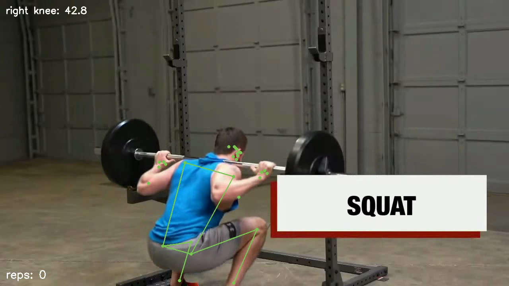
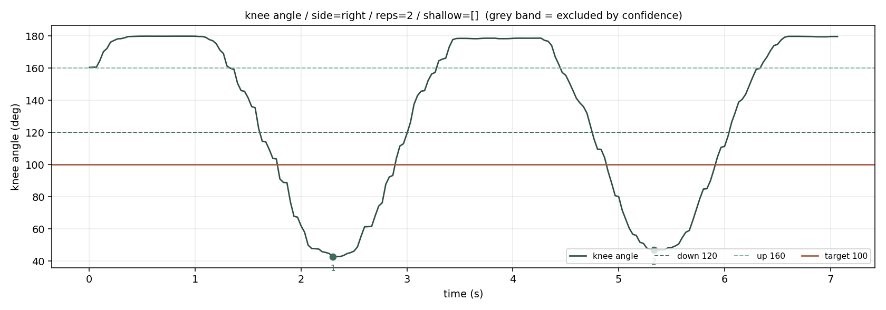
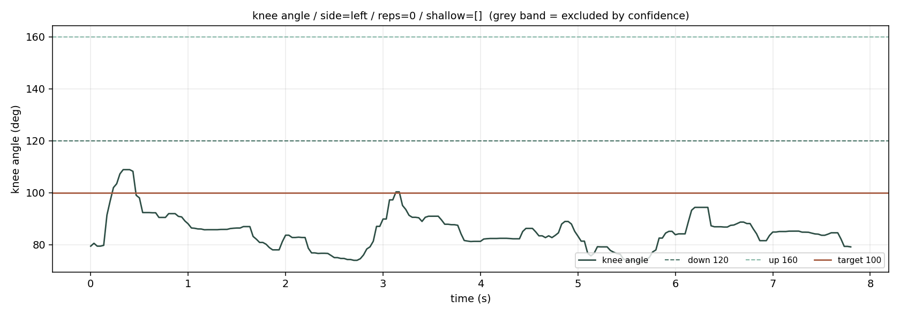
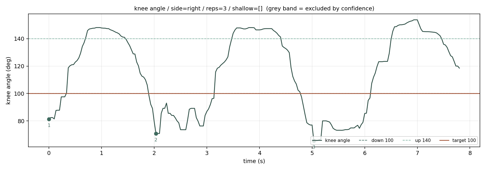

# 웃카타아사나 반복 판정 PoC

> **AIFFEL AI 에이전트 1기 · Main Quest 2**
> 요가 지도 현장에서 **반복 횟수를 세고, 충분히 앉지 않은 회차를 표시**하는 PoC입니다.
> 자세 추정 모델을 노트북에서 로컬로 돌립니다. **회원 영상을 외부로 전송하지 않습니다.**

| 항목 | 내용 |
|---|---|
| 도메인 | 요가·명상 그룹 수업 지도 |
| 업무 유형 | 검사와 판독 (사람이 보고 판정하는 일) |
| 병목 | **정확도가 아니라 동시 처리와 지속 시간** |
| 쓴 모델 | MediaPipe Pose Landmarker (full) · Apache 2.0 |
| 실행 위치 | 노트북 로컬 (CPU) |

---

## 문서

| 문서 | 내용 |
|---|---|
| [docs/01_문제정의서.md](docs/01_문제정의서.md) | 도메인 · 현재의 문제 · 개선 가설 · 대상 사용자 · **성공 기준** |
| [docs/02_모델선정.md](docs/02_모델선정.md) | 후보 셋 · **제외 조건을 점수와 섞지 않은 이유** · 최종 선택 근거 |
| [docs/03_검증결과.md](docs/03_검증결과.md) | 기존 방식과의 비교 · **실패 사례** |
| [docs/04_한계와_다음단계.md](docs/04_한계와_다음단계.md) | 한계 · 다음 스텝 |

> **성공 기준은 PoC를 만들기 전에 적었고, 정답(`data/ground_truth.csv`)도 모델을 돌리기 전에 적었습니다.**
> 결과를 본 뒤에 정답을 정하면 이미 나온 답 쪽으로 기준이 기울어 채점이 성립하지 않습니다.

---

## 실행 방법

### 0. 준비

```bash
git clone <이 저장소>
cd yoga-pose-poc

python3 -m venv .venv
.venv/bin/pip install -r requirements.txt
```

### 1. 모델 내려받기 (9.4MB, 한 번만)

```bash
mkdir -p assets
curl -L -o assets/pose_landmarker_full.task \
  https://storage.googleapis.com/mediapipe-models/pose_landmarker/pose_landmarker_full/float16/latest/pose_landmarker_full.task
```

### 2. 검증용 영상 받기

이 저장소의 결과를 그대로 재현하려면 (자유 라이선스 영상 3건, 약 5MB):

```bash
.venv/bin/python src/fetch_data.py
```

출처와 라이선스: [data/SOURCES.md](data/SOURCES.md)

> 영상 파일은 저장소에 커밋하지 않습니다. 회원 영상은 개인정보이고,
> CC 영상은 재배포 대신 내려받기 주소를 제공합니다.

### 2-1. 내 영상으로 하려면

`data/videos/` 에 **측면에서 찍은** 영상을 넣습니다. 파일 이름이 그대로 `video_id`가 됩니다.

```
data/videos/v01.mp4
data/videos/v02.mp4
...
```

**촬영 조건** — 판정 항목이 촬영 방향을 정합니다. 자세한 이유는 [문제정의서 7절](docs/01_문제정의서.md) 참조.

| 판정할 것 | 필요한 방향 |
|---|---|
| **무릎 굽힘 깊이** ← 이 PoC | **측면** |
| 좌우 무릎 벌어짐 | 정면 (이 PoC 범위 밖) |

- 측면 · 전신이 화면에 들어오게 · 카메라 고정 · 밝은 조명

### 3. 정답 적기 — **반드시 모델을 돌리기 전에**

`data/ground_truth.csv` 를 채웁니다. 양식은 `data/ground_truth.EXAMPLE.csv`.

```csv
video_id,reps_true,shallow_reps,manual_seconds,note
v01,12,"3,7",95,정상 조명·몸에 붙는 옷
v02,10,,80,헐렁한 상의 ← 어려운 것
```

| 열 | 뜻 |
|---|---|
| `reps_true` | 사람이 센 반복 횟수 |
| `shallow_reps` | 충분히 앉지 않은 회차 번호 (없으면 빈칸) |
| `manual_seconds` | 사람이 영상을 보며 세는 데 걸린 시간(초) — **기존 방식과의 비교에 씀** |
| `note` | 촬영 조건. **어려운 것은 반드시 표시** |

> 자료 10~20건 중 **3~4건은 어려운 것**을 넣으십시오.
> 쉬운 것만 모으면 후보들이 전부 비슷해 보이고 표가 아무것도 알려 주지 않습니다.

### 4. 전부 처리하고 검증까지 한 번에

```bash
.venv/bin/python src/run_all.py
```

값을 바꿔 가며 돌리려면:

```bash
.venv/bin/python src/run_all.py --target-angle 95 --confidence-threshold 0.6
```

### 5. 영상 한 건만

```bash
.venv/bin/python src/run_poc.py --video data/videos/v01.mp4
```

### 6. 검증만 다시

```bash
.venv/bin/python src/evaluate.py --run results/<실행시각>
```

### 7. 판정 로직 시험 (영상 없이 가능)

```bash
.venv/bin/python src/test_count_reps.py
```

---

## 판정에 쓰는 값 — 전부 인자입니다

**코드에 숫자를 박지 않았습니다.** 값을 바꾸려고 코드를 고칠 필요가 없습니다.

| 인자 | 기본값 | 뜻 |
|---|---|---|
| `--confidence-threshold` | 0.5 | 이 값을 **못 넘은 관절로는 각도를 계산하지 않음** |
| `--confidence-field` | visibility | 신뢰도로 쓸 값 (visibility / presence) |
| `--down-angle` | 120 | 이 값보다 작아지면 **내려간 것으로** 봄 |
| `--up-angle` | 160 | 이 값보다 커지면 **올라온 것으로** 봄 |
| `--target-angle` | 100 | 이 값 **이하**로 내려가야 '충분히 앉았다' |
| `--smooth-window` | 5 | 각도 중앙값 필터 창 (1이면 필터 없음) |
| `--min-frames-down` | 3 | DOWN을 최소 몇 프레임 유지해야 한 번으로 셀지 |
| `--side` | auto | 각도를 잴 다리. auto면 **신뢰도가 높은 쪽**(카메라에 가까운 다리) |
| `--rotate` | 0 | 입력 영상 회전 보정 |

> ⚠️ `--up-angle`은 `--down-angle`보다 **커야** 합니다.
> 두 값을 벌려 두지 않으면 그 경계에서 몸이 흔들릴 때 **한 번이 여러 번으로 세어집니다.**
> 같게 주면 스크립트가 거부합니다.

---

## 결과물

`results/<실행시각>/<video_id>/` 에 쌓입니다. **다시 돌려도 덮어쓰지 않습니다.**

| 파일 | 내용 |
|---|---|
| `frames.csv` | 프레임별 관절 좌표 · **신뢰도** · 무릎 각도 · **제외 사유** (반올림하지 않음) |
| `reps.csv` | 반복별 시작·최저·끝 프레임, **최저 각도**, 얕은 회차 여부 |
| `angle_plot.png` | 무릎 각도 그래프 + 판정선 + **제외 구간 회색 띠** |
| `overlay.mp4` | **관절을 그린 영상.** 신뢰도를 넘은 관절은 초록, 못 넘은 관절은 빨강 |
| `summary.json` | 쓴 값 전부 + 결과 |
| `evaluation.md` · `metrics.json` | 정답과 대조한 검증 결과 (`evaluate.py`) |

### ★ `overlay.mp4` 를 반드시 눈으로 보십시오

신뢰도가 낮은 관절은 **숫자로 보면 "조금 낮은 값"으로 읽힙니다.**
그려 보면 **그 관절이 몸의 다른 부위에 찍혀 있는 것**이 보입니다.
각도를 믿기 전에 이 영상을 보는 것이 **가장 빠른 검산**입니다.

---

## 동작 결과

### 실행 화면

```
입력      : cc01_squat_demo.webm  (213프레임 / 7.1초 / 30.0fps)
쓴 다리   : right  (신뢰도 평균 left=0.801 right=0.952)
제외 프레임: 0 / 213  (0.0%)
반복      : 2회
얕은 회차 : 없음  (목표 100도 이하)
처리 시간 : 4.0초  (영상 길이 대비 1.79배속)
```

### 관절 오버레이 — 반복 최저점



- 초록 = 신뢰도가 임계값을 넘은 관절 / 빨강 = 못 넘은 관절
- 좌상단에 무릎 각도(42.8°), 좌하단에 누적 반복 수

### 각도 그래프 — 정상 동작



- 실선이 무릎 각도, 점선이 내려감·올라옴 경계, 굵은 선이 목표 각도
- 점은 각 반복의 최저점 — 주황색이면 목표에 못 미친 회차
- 두 번의 하강이 명확히 보이고, **정답(2회)과 일치**

### ★ 실패 사례 — 같은 코드, 다른 동작

**한쪽 다리 스쿼트**에서 기본 임계값으로 **0회**가 나왔습니다.



무릎이 `up-angle=160`을 **한 번도 넘지 못합니다.** 기본값이 두 다리 스쿼트 기준이라 그렇습니다.
그리고 `--side auto`가 신뢰도가 높은 왼다리를 골랐는데, 그 다리는 **129°까지밖에 안 펴집니다.**

다리와 임계값을 **둘 다** 고치면 잡힙니다.



| 다리 | `down`/`up` | 결과 |
|---|---|---|
| auto (=left) | 120 / 160 | **0회** |
| auto (=left) | 100 / 140 | **0회** ← 임계값만으로는 안 됨 |
| right | 120 / 160 | **0회** ← 다리만으로도 안 됨 |
| **right** | **100 / 140** | **3회 ⭕** |

> **조용히 틀리지 않았습니다.** 그럴듯한 숫자 대신 `0회 + "마지막에 내려간 채로 영상이 끝났습니다"`
> 경고를 냈습니다. 검사·판독 업무에서는 이 차이가 정확도보다 중요합니다.

---

## 검증 요약

| 기준 | 목표 | RUN A (동일 파라미터) | RUN B (동작별 조정) |
|---|---|---|---|
| **S1** 반복 횟수 일치 | 90% | ❌ **72.7%** (8/11) | ✅ **100%** (11/11) |
| **S2** 얕은 회차 F1 | 0.70 | ⚠️ **평가 불가** | ⚠️ **평가 불가** |
| **S3** 처리 속도 | 실시간 초과 | ✅ 1.79~1.92배속 | ✅ 1.78~1.94배속 |

**S2가 '미달'이 아니라 '평가 불가'인 이유**: 검증 자료에 **얕은 회차가 하나도 없어**
판정할 대상 자체가 없었습니다. 목표 각도를 올리면 통과한 것처럼 보이지만,
**임계값을 임의로 정한 뒤 만족했다고 적으면 그 채점표로는 아무것도 판단할 수 없습니다.**

자세한 내용: [docs/03_검증결과.md](docs/03_검증결과.md)

### 기존 방식과의 비교

| | 기존 (사람이 영상 보며 셈) | PoC |
|---|---|---|
| 총 소요 | 42초 | **23초 (1.8×)** |
| 회차별 기록 | 남지 않음 | `reps.csv`로 남음 |
| 동시 처리 | 불가 | 영상 수만큼 |
| 다른 동작 대응 | 사람은 바로 적응 | **임계값을 다시 잡아야 함** |

> 속도 이득(1.8×)은 크지 않고, 애초에 도입 근거도 아니었습니다.
> 병목은 **일관성·지속 시간·동시 처리**였고, 값이 나오는 곳은 **기록이 남는다**와 **동시 처리가 된다**입니다.

---

## 저장소 구조

```
yoga-pose-poc/
├─ README.md                     ← 이 파일
├─ requirements.txt
├─ assets/pose_landmarker_full.task   ← 내려받기 (커밋 안 함)
├─ data/
│  ├─ ground_truth.csv           ← 돌리기 전에 적은 정답
│  ├─ ground_truth.EXAMPLE.csv   ← 양식
│  ├─ SOURCES.md                 ← 검증 영상 출처·라이선스·해시
│  └─ videos/                    ← 영상. .gitignore 로 제외
├─ docs/
│  ├─ 01_문제정의서.md
│  ├─ 02_모델선정.md
│  ├─ 03_검증결과.md
│  ├─ 04_한계와_다음단계.md
│  └─ img/                       ← 시연 자료
├─ src/
│  ├─ pose_common.py             ← 각도 계산 · 중앙값 필터
│  ├─ count_reps.py              ← 반복 판정 (히스테리시스)
│  ├─ run_poc.py                 ← 영상 → 좌표 → 각도 → 반복 → 결과물
│  ├─ run_all.py                 ← 일괄 실행 + 검증
│  ├─ evaluate.py                ← 정답과 대조
│  ├─ fetch_data.py              ← 검증 영상 내려받기 (재현용)
│  └─ test_count_reps.py         ← 판정 로직 시험 (영상 불필요)
└─ results/                      ← 실행 시각별 결과
```

---

## 개인정보 처리

- 회원의 몸이 찍힌 영상입니다. **모든 처리는 로컬**에서 수행하며 네트워크 호출이 없습니다.
- 영상 원본은 **저장소에 커밋하지 않습니다** (`.gitignore`).
- 검증에 필요한 것은 **좌표·각도 CSV와 판정 결과**뿐입니다.

---

## 이 PoC가 하지 않는 것

| 안 하는 것 | 이유 |
|---|---|
| **교정 지시를 내는 것** | 몸에 영향을 주는 일입니다. AI는 **후보를 좁혀 사람에게 넘기는 앞단**까지만 |
| **정렬의 옳고 그름 판정** | 유파마다 기준이 다릅니다 → 정답을 만들 수 없습니다 |
| 좌우 무릎 벌어짐 판정 | **정면 촬영이 필요**합니다. 이 영상(측면)으로는 불가 |
| 실시간 피드백 | PoC 범위 밖 |

---

## 라이선스

- 이 저장소의 코드: MIT
- MediaPipe Pose Landmarker: Apache 2.0 (확인일 2026-08-12)
